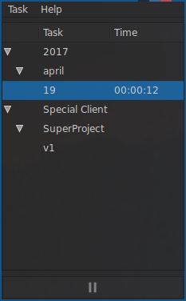

# drtimetracker
Really simple Mono/GTK# based time tracker. Developed for Linux, but should work just fine in Windows & MacOS too.

Supports three levels of tasks.

Press Play/Pause button to start/stop tracking selected task.
You can also double-click on task name.

Serializes to binary file .local/tracker.sav, saved in home directory.

Open source, MIT license.

### Why?

I've realized there is lack of simple, minimalistic, cloud-free task time-trackers applications right now. If you feel the same, please enjoy.

UI is slightly based on KDE4 ktimetracker which is now deprecated.

### Usage:

Direct binary download: https://github.com/dRaiser/drtimetracker/blob/master/tracker/bin/Debug/drtimetracker.exe

mono "drtimetracker.exe"

### Screenshot:

